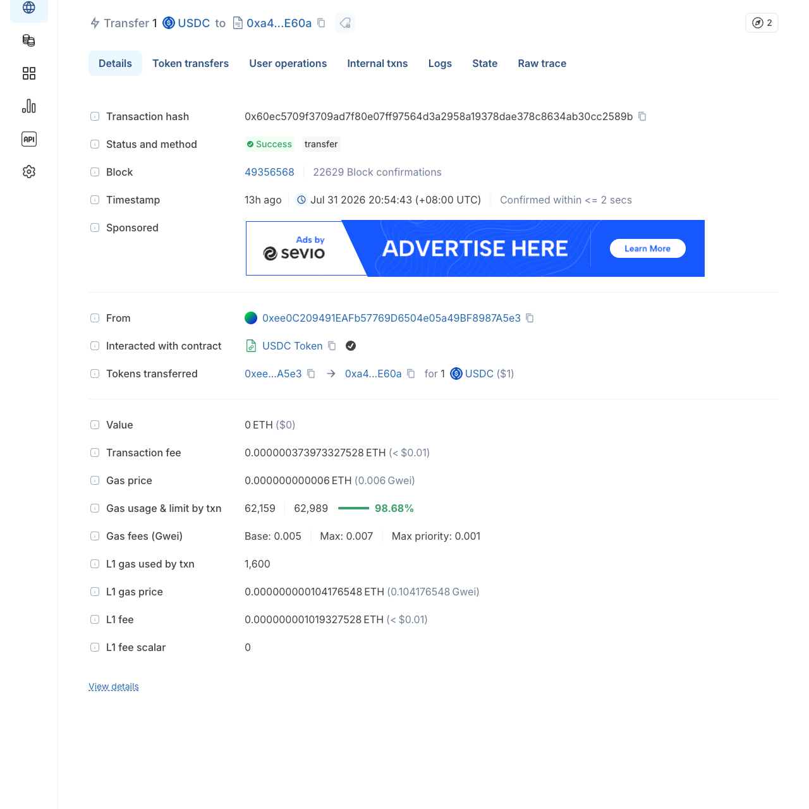
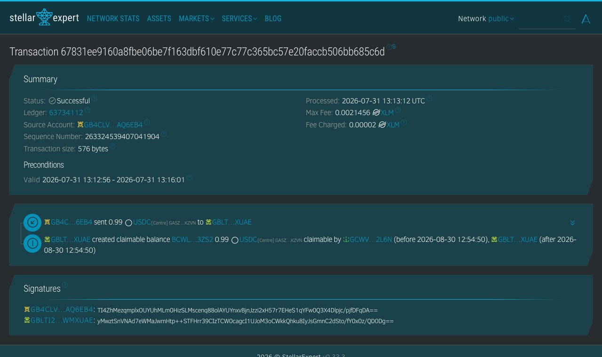
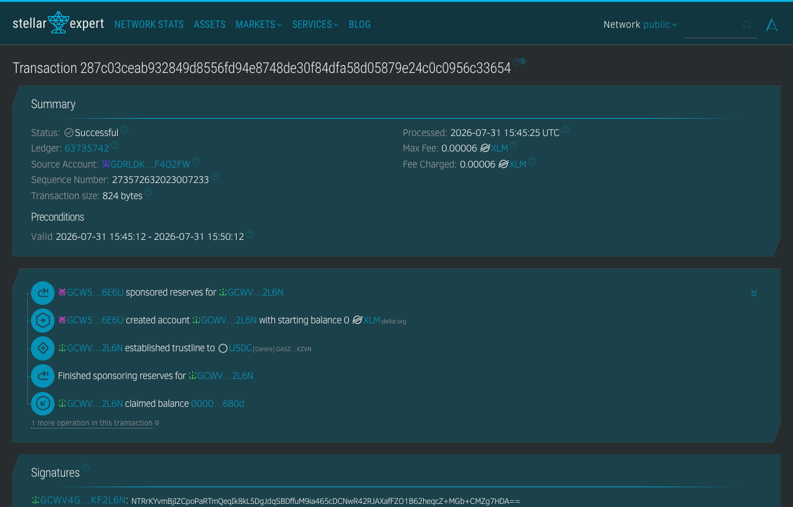
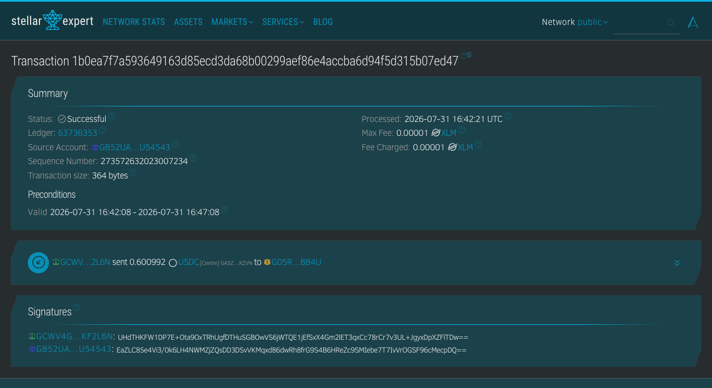
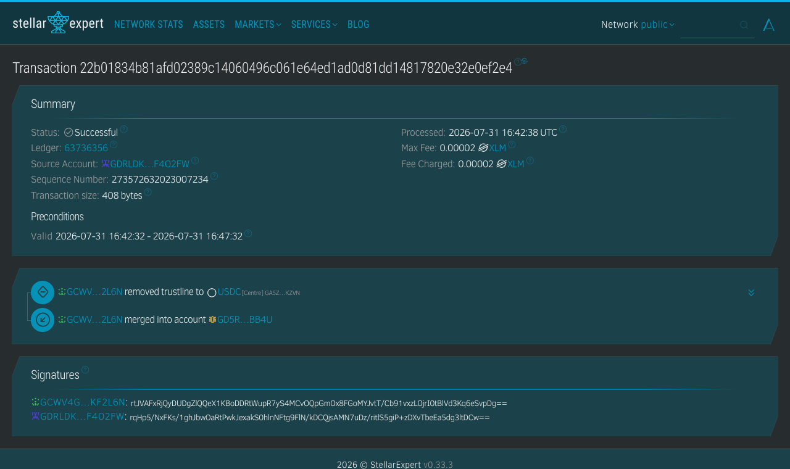
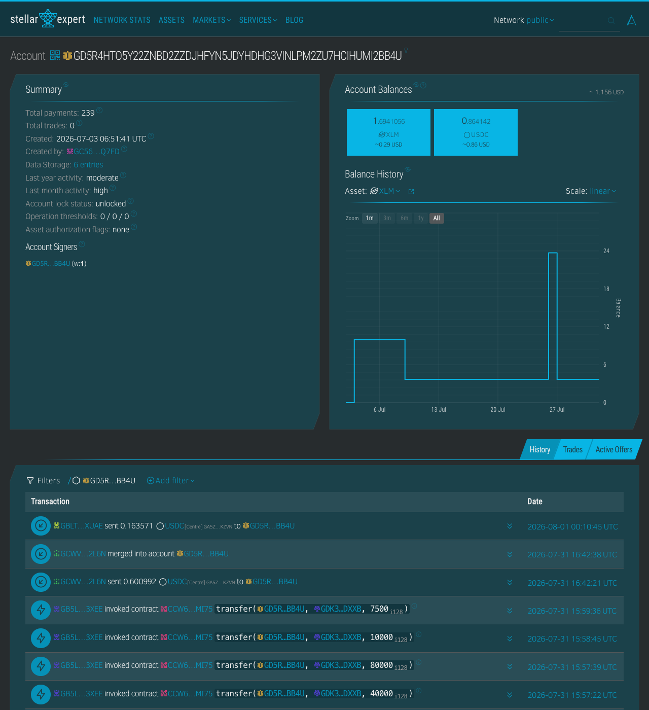

# Production Walkthrough — bridge → claim → close → rebate

A real, end-to-end run of the sponsored-claim rail on **production**, executed
2026-07-31 / 08-01 with real money. Every hash below is verifiable on a public
explorer. All addresses shown are our own test wallets.

**The run in one line:** $1 USDC left a Base wallet, arrived as a claimable
balance for a brand-new Stellar account that held **0 XLM for its entire
life**, was claimed with a single local signature, spent out, and the account
was then closed — with the sponsored XLM reserves rebated back **in USDC**.
The recipient never touched XLM and never paid gas.

> **Fee note:** this run executed under the old 7-decimal-place fee formula
> (fee 0.3890080, net 0.6009920 on a $0.99 park). Under the current
> whole-cent-ceiling rule the same order quotes
> **fee $0.40 / net $0.59**. The quote example in step 1 shows today's
> numbers; the on-chain records show the historical 7dp amounts.

Cast:

| Role | Address |
|---|---|
| Recipient (fresh Stellar wallet, 0 XLM, later merged away) | `GCWV4GABBFLD5GWBILJVHQS75A5DWBRTL2I6JX7J3T3TQ5QZYPKF2L6N` |
| Source (Base wallet) | `0xee0C209491EAFb57769D6504e05a49BF8987A5e3` |
| Intent deposit address (Base) | `0xa443f34ef6cb4aef4107ebc11ca214238f8FE60a` |
| Close destination (Stellar) | `GD5R4HTO5Y22ZNBD2ZZDJHFYN5JDYHDHG3VINLPM2ZU7HCIHUMI2BB4U` |
| Rozo claim custody | `GBLTI2TTQXUAYNKGCQ63YA55KTFEAOQJ3DPBPELNPWCJVE76ADWMXUAE` |

---

## 0. Run it yourself — setup

You need Node 20+ and a Base wallet funded with:

- **USDC**: the amount you want to send — 1 USDC is enough for a full run
- **ETH**: ~0.0002 ETH, which covers a few hundred deposits (one costs well
  under a cent of gas)

Everything below talks to public production endpoints under the shared test id
`rozoTest`: no signup, no API key, no allowlisting, no account with us.
Sponsored payouts under `rozoTest` are limited to **$0.01 – $100 net per
payout**, which covers this entire walkthrough.

For a higher limit, or for anything you intend to ship, register your own
application at **<https://partners.rozo.ai>** (application type: **wallet**).
You get an `appId` and an API key, used **as a pair** — a registered appId
without its key is rejected with `400 missing_api_key`. Put both in `.env` as
`APP_ID` and `ROZO_API_KEY`; the deposit script sends the key as `X-API-Key`.

Budget a couple of minutes of wall clock for the bridge and claim (the run
recorded below predates a 2026-08-03 backend scheduling fix and waited 18
minutes for the park step — see §3), and note that the closing rebate is
asynchronous — in the run recorded below it landed about 7.5 hours after the
account was closed.

What that 1 USDC turns into, at XLM ≈ $0.175 (the price quoted in §1 — your
quote will differ slightly with spot):

| | USDC |
|---|---:|
| you send | 1.00 |
| bridge fee | −0.01 |
| **parked as a claimable balance** | **0.99** |
| claim fee (2 XLM reserve deposit + $0.05, ceiled to the cent) | −0.40 |
| **lands in the brand-new wallet, which paid zero gas** | **0.59** |
| reserve rebate if you later close the account (95%, in USDC) | +0.16 |
| **total recovered** | **0.75** |

Send more and only the claim fee stays flat — it is a fixed reserve deposit,
not a percentage. A $100 order pays the 0.1 % bridge fee ($0.10) and the same
$0.40 claim fee, so $99.50 lands. And if the destination already has a USDC
trustline there is no claim fee at all.

```bash
git clone <this repo> && cd rozo-paysponsor
npm install
cp .env.example .env      # then put your funded Base private key in
                          # DEPOSIT_EVM_PRIVATE_KEY — .env is gitignored
```

The four commands map one-to-one onto the steps below (`xdr-guard.mjs` is a
shared module, not something you run):

| Script | Step |
|---|---|
| `create-wallet.mjs stellar` | makes the fresh recipient wallet (§2) |
| `deposit-intents.mjs --amount 1` | quotes, then bridges — **one command, §1 and §2 are its two halves** |
| `claim-intents.mjs` | the recipient's zero-gas claim (§4) |
| `close-intents.mjs --destination G…` | close + payout (§5) |

Each run spends real money — a $1 order costs $1 plus a fraction of a cent of
Base gas. Keys are read from `.env` or the gitignored `wallets/` directory and
are never passed on the command line.

---

## 1. Quote — the fee, before any money moves

`POST /payments?dryrun=true` with the same body as a real create returns the
frozen fee math and creates nothing. `deposit-intents.mjs` calls it on every
run and prints the result **before** it creates or funds the intent, so the
first thing you see is what you will pay:

```
$ node scripts/deposit-intents.mjs --amount 1     # ← the one command; §2 is its second half
── dryrun quote ──────────────────────────────────────
mode                    sponsored        (destination has no trustline)
xlmUsdPrice             $0.175
sponsorFee              $0.40            (2 XLM × 0.175 + 0.05 = 0.40 → ceil to cent)
claimableBalanceAmount  0.99 USDC        (1.00 − $0.01 bridge fee)
netAmount               0.59 USDC        (0.99 − 0.40)
──────────────────────────────────────────────────────
```

> **This is not a separate dry-run command.** The script has no quote-only
> flag: it quotes and then pays, in one invocation. Running it once produces
> both this output and the payment in §2 — running it twice pays twice. If the
> API cannot return a sponsorship quote, the script aborts before spending
> anything.

`mode: "direct"` would mean the destination already has the USDC trustline —
no sponsorship needed, no sponsor fee.

## 2. Bridge — $1 USDC in on Base

Straight after printing that quote, the same invocation creates the intent. The
create returns a dedicated deposit address; one plain ERC-20 transfer funds it.
No approvals, no contract calls from the payer.

```
(continued output of the same command)
intent created  intent: stellarsponsor  destination: GCWV4GAB…YPKF2L6N
deposit address (Base): 0xa443f34ef6cb4aef4107ebc11ca214238f8FE60a
sending 1.000000 USDC from 0xee0C2094…BF8987A5e3 …
✔ Base tx confirmed: 0x60ec5709f3709ad7f80e07ff97564d3a2958a19378dae378c8634ab30cc2589b
```



Explorer: [Basescan](https://basescan.org/tx/0x60ec5709f3709ad7f80e07ff97564d3a2958a19378dae378c8634ab30cc2589b) ·
[Blockscout](https://base.blockscout.com/tx/0x60ec5709f3709ad7f80e07ff97564d3a2958a19378dae378c8634ab30cc2589b)

## 3. Park — claimable balance on Stellar

The custody account then parks the full bridged amount (0.99 USDC) as a
**claimable balance** — in this run 18 minutes after the Base transfer
confirmed (12:54:43 → 13:13:12 UTC). That gap was a backend scheduling bug —
the status write-back only ran when the next sponsored order arrived — fixed
on 2026-08-03: the payout itself lands on-chain in about a minute and the
status flips to `ready` within ~30 seconds of that, so current runs park in
**1–2 minutes**. The script still polls for up to 45 minutes as a safety
margin and
prints the intent id up front, so a run you interrupt can be resumed with
`claim-intents.mjs --payment <id>`. Note the two claimants: the recipient (any
time before the 30-day TTL) and custody (reclaim after expiry). The recipient
account still does not exist on-chain at this point.

```
$ curl -s $API/payments/$ID/claim | jq '{status, amount, claimableBalanceId}'
{
  "status": "claim_ready",
  "amount": "0.99",
  "claimableBalanceId": "00000000acb139f478147838a81e63ef518e82ddf28a590bbeec5963949b4bd8b492680d"
}
```



Explorer: [stellar.expert — park tx `67831ee9…`](https://stellar.expert/explorer/public/tx/67831ee9160a8fbe06be7f163dbf610e77c77c365bc57e20faccb506bb685c6d)

## 4. Claim — one signature, zero gas

The recipient asks the API to build a sponsored transaction, signs it
**locally** with their own key, and submits the XDR back. In one atomic
transaction Rozo's signer sponsors the reserves, **creates the account with a
starting balance of 0 XLM**, establishes the USDC trustline, and the
recipient claims the balance. Fee payer: Rozo. XLM held by the recipient at
any point: **zero**.

Before signing, the script parses the returned XDR and checks it against what
it asked for — public network, known operation types, and every operation your
key would authorize matching the expected account, asset, destination and
amount. A client that signs whatever a server hands back is teaching the wrong
habit; see `scripts/xdr-guard.mjs`.

```
$ node scripts/claim-intents.mjs
building sponsored claim for GCWV4GAB…YPKF2L6N …
✔ signable XDR received (824 bytes)
xdr verified: 5 ops, yours: changeTrust, claimClaimableBalance, payment
✔ signing locally
✔ submit accepted
✔ tx on Horizon: 287c03ceab932849d8556fd94e8748de30f84dfa58d05879e24c0c0956c33654
delivered: 0.6009920 USDC   (0.99 − 0.3890080 sponsor fee, old 7dp rate)
recipient XLM balance: 0 (all reserves sponsored)
```



Explorer: [stellar.expert — claim tx `287c03ce…`](https://stellar.expert/explorer/public/tx/287c03ceab932849d8556fd94e8748de30f84dfa58d05879e24c0c0956c33654)

## 5. Close — sweep and merge, still zero gas

Account close is two sponsored legs, both fee-paid by Rozo:

**Leg 1 — transfer:** the remaining 0.6009920 USDC is sent to the
destination the user chose (`GD5R…BB4U`).

```
✔ leg 1 transfer: 1b0ea7f7a593649163d85ecd3da68b00299aef86e4accba6d94f5d315b07ed47
  0.6009920 USDC → GD5R4HTO…HUMI2BB4U
```



**Leg 2 — merge:** the trustline is removed and the account is merged away.
The recipient account no longer exists on the ledger.

```
✔ leg 2 merge: 22b01834b81afd02389c14060496c061e64ed1ad0d81dd14817820e32e0ef2e4
  trustline removed, GCWV4GAB…YPKF2L6N merged into GD5R4HTO…HUMI2BB4U
account gone. awaiting reserve rebate…
```



Explorer: [transfer `1b0ea7f7…`](https://stellar.expert/explorer/public/tx/1b0ea7f7a593649163d85ecd3da68b00299aef86e4accba6d94f5d315b07ed47) ·
[merge `22b01834…`](https://stellar.expert/explorer/public/tx/22b01834b81afd02389c14060496c061e64ed1ad0d81dd14817820e32e0ef2e4)

## 6. Rebate — sponsored reserves come back in USDC

Closing unlocks the sponsored XLM reserves. Rozo automatically rebates **95%
of the unlocked XLM, converted to USDC at execution-time price**, to the same
destination — the user ends the lifecycle holding only USDC, having never
owned XLM.

This leg is **asynchronous**: it is queued at close confirmation and paid out
by a background worker on its next pass. In this run the rebate landed
**7 h 28 m after the merge** (16:42:38 → 00:10:45 UTC). `close-intents.mjs`
watches for it for three minutes and then exits successfully with a note — it
matches the actual incoming payment from custody rather than a rising balance,
so an unrelated deposit into your destination cannot be mistaken for a rebate.

```
rebate detected on GD5R4HTO…HUMI2BB4U:
  +0.1635710 USDC  from custody GBLTI2TT…ADWMXUAE  (95% × 1 XLM × spot)
lifecycle complete: deposit → park → claim → close → rebate, user gas paid: $0
```

The destination account history shows all three arrivals — the swept
balance, the merge, and the rebate payment from custody:



Explorer: [stellar.expert — destination account `GD5R…BB4U`](https://stellar.expert/explorer/public/account/GD5R4HTO5Y22ZNBD2ZZDJHFYN5JDYHDHG3VINLPM2ZU7HCIHUMI2BB4U)

---

## Timeline recap

| UTC (2026) | Event | Tx |
|---|---|---|
| 07-31 12:54:43 | $1 USDC deposit on Base | `0x60ec5709…30cc2589b` |
| 07-31 13:13:12 | Park: 0.99 USDC claimable balance created (+18 m) | `67831ee9…bb685c6d` |
| 07-31 15:45:25 | Claim: sponsored create + trustline + claim, 0 gas | `287c03ce…56c33654` |
| 07-31 16:42:21 | Close leg 1: 0.6009920 USDC swept to destination | `1b0ea7f7…15b07ed47` |
| 07-31 16:42:38 | Close leg 2: trustline removed, account merged | `22b01834…2e0ef2e4` |
| 08-01 00:10:45 | Rebate: +0.1635710 USDC from custody to destination (+7 h 28 m) | (payment on destination account) |

The gaps between park → claim → close are just when a human ran the next
command; the deposit → park and close → rebate gaps are the system's own
latency. Each individual step (claim, each close leg) confirms in seconds.
